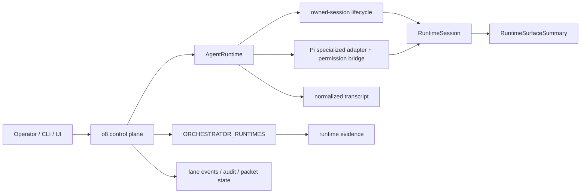

# Tern × o8 architecture audit

Status: first evidence slice for [#3365](https://github.com/hurttlocker/o8/issues/3365).  
Scope: current-tree ownership, semantic-rendering boundary, protocol-fixture plan.  
Non-goal: no Tern runtime, persistent-session backend, native actions, or Tern dependency.

## Credits

- @hurttlocker / Marquise Hurtt: #3365's authority boundary, build order, and acceptance constraints.
- Can Bölük / Stencil Labs: Tern Surface Protocol, the public `@stencil-hq/tern` SDK, and OMP's mature TSP integration.
- Kevin Rajan / kvnloo: downstream Hermes × Tern experiments that supplied the ownership-matrix and evidence-receipt method used here.

The Hermes work is evidence, not an implementation template. o8 has different authority and lifecycle owners, so no Hermes state machine or wire layer should be copied wholesale.

## Current truth



| Concern | Current owner | Tern may do | Tern must not do |
| --- | --- | --- | --- |
| runtime identity | `src/lib/orchestrator/runtime-capabilities.ts`, `src/lib/runtimes/types.ts` | render it | become an `OrchestratorRuntime` / `RuntimeId` |
| provider session semantics | `AgentRuntime` adapters | display normalized state | reinterpret provider protocol |
| process lifecycle | `src/lib/runtimes/shared/owned-session/*` | host/retain a pane | decide launch/resume/interrupt outcomes |
| Pi RPC + permissions | `src/lib/pi/owned.ts`, `permission-bridge.ts`, `src/lib/runtimes/pi.ts` | present state/input | become Pi lifecycle or approval authority |
| product surface | `RuntimeSurfaceSummary` in `src/lib/fleet/types.ts` | project to TSP | create a second session model |
| transcript truth | runtime adapters + normalized transcript storage | render content | replace history with Tern scrollback |
| packet/lane/review outcome | o8 orchestration + audit | show status/actions | infer outcome from pane/process state |
| runtime evidence | `src/lib/runtime/runtime-evidence.ts` | render evidence | turn unknown/stale into guesses |

Result: read-only TSP work does **not** require a new runtime abstraction. o8 already has a provider-neutral runtime boundary and product-facing runtime surface.

## Semantic seam before renderer

```text
existing o8 API/domain result
        |
        v
pure semantic view model
      /   \
     v     v
 text      TSP
renderer  renderer
     \     /
      same facts/actions
```

### Invariants

1. **Authority != presentation.** Semantic nodes contain facts and action identifiers; they never grant authority.
2. **One source, multiple renderers.** Text and TSP derive from the same semantic model.
3. **Fallback is normal.** No/malformed TSP, unsupported kind, or renderer failure returns ordinary text.
4. **Unknown stays unknown.** Presentation cannot invent progress, health, cost, model, session, or packet truth.
5. **Detach != terminate.** Surface disappearance is presentation state only.
6. **No terminal-derived packet outcome.** Pane/process/scrollback persistence cannot complete, fail, approve, merge, or settle a packet.
7. **No hidden dialect.** Prefer the official Tern SDK over copying the downstream Hermes wire kernel unless a measured SDK gap requires a minimal adapter.

## Smallest useful file boundary

Keep the first experiment in the standalone CLI; do not put Tern in `AgentRuntime`, the runtime catalog, or Pi.

```text
cli/src/presentation/
  model.ts          # renderer-neutral view model
  text.ts           # ordinary terminal renderer

cli/src/tern/
  renderer.ts       # TSP adapter; no business logic
  negotiation.ts    # only if SDK does not own it
  fixtures/         # deterministic hello/fallback/credit fixtures

cli/src/commands/
  lab-tern.ts       # explicitly experimental and read-only
```

This is a proposed boundary, not a mandate to create every file. If one file proves the seam, prefer one file. Keeping it in the CLI avoids importing server internals or creating a shared-state package prematurely.

## First semantic targets

Start read-only:

1. attention/status summary
2. packet status/info
3. runtime evidence
4. review summary

Avoid approvals, dispatch, merge, retry, steer, interrupt, and session mutation until renderer/fallback behavior is proven.

### Information-equivalence test

```text
semantic fixture
  -> TextRenderer -> normalized fact set A
  -> TspRenderer  -> fake peer -> normalized fact set B

assert A == B
```

Compare information, not ANSI bytes or pixels. Native layout may differ; facts, labels, state, and governed-action availability may not.

## Protocol evidence plan

The public TypeScript SDK is currently `@stencil-hq/tern@0.1.0`, MIT, Node >=22, matching o8's Node 22 floor. It covers framing/chunking, handshake, surfaces, diffing, events, credit flow control, JSONL recording, and plain fallback.

Before adding it, prove packaging does not turn Tern into a mandatory execution dependency. Ordinary CLI startup must remain unchanged.

CI must need neither Tern binary nor closed-beta daemon. Fixtures/fakes should cover:

- TSP hello before DA1 -> native path
- DA1/no hello -> text fallback
- malformed hello -> text fallback
- unsupported kind -> text fallback
- renderer exception -> text fallback
- delayed ACK/exhausted credit -> bounded/coalesced output
- resize/theme/visibility -> presentation only
- surface gone/detach -> no runtime or packet mutation

JSONL recording/replay is a useful local receipt; committed fixtures remain CI authority.

## Pi / OMP coexistence questions before persistence

Pi is the highest-risk ownership seam because it is specialized.

1. Who owns stdin while Pi runs under a Tern pane?
2. Can a terminal pane bypass the Pi RPC/permission bridge?
3. Can o8 still resume/steer/interrupt through the same `AgentRuntime` path?
4. If the pane closes, can o8 still discover/read/operate the session?
5. If the process exits, can retained Tern scrollback look falsely live?
6. Can a restored pane re-associate without pane identity becoming provider-session identity?

OMP is the canonical TSP behavior reference; o8's Pi adapter remains the authority reference.

## Slices

### S0 — architecture audit
This document. No behavior change.

### S1 — semantic model + text parity
Extract one read-only CLI surface into a pure semantic model and prove current text is unchanged.

### S2 — fake-peer TSP renderer
Add protocol fixtures/TSP renderer behind an experimental path. No Tern daemon in CI.

### S3 — Pi/OMP coexistence proof
Trace/test PTY, stdin, and session ownership before persistence changes.

### S4 — real SDK/daemon experiment
Only with beta evidence. Measure detach, reconnect, daemon restart, scrollback restore, credits/backpressure, and process survival.

### S5 — persistent session backend
Only if S4 proves a missing abstraction. Any `InteractiveSessionBackend`-style layer must be earned by evidence.

### S6 — governed native actions
TSP events call existing o8 commands/authority checks. No renderer-owned authorization.

## Reusable evidence from Hermes

- explicit authority/presentation ownership matrix
- deterministic protocol fixtures
- singular "needs user" attention peak
- ambient/completed state stays visually quiet
- determinate progress only with a known denominator
- measurable receipts: salience count, persistent rows, eye travel, violations
- real captures are evidence; generated mockups are proposals
- isolated, independently testable protocol slices

The Hermes custom APC/TSP kernel should **not** be imported into o8 by default. The official SDK now covers the wire responsibilities that kernel was built to explore.

## Exit criteria for the first implementation PR

- no new runtime ID or runtime-catalog edit
- no `AgentRuntime` or Pi lifecycle semantic change
- no database migration or mutating TSP action
- existing text preserved without TSP
- fake-peer CI needs no Tern binary
- semantic information parity proven
- TSP errors fall back to text, never fail the o8 command
- unknown/evidence fields remain truthful
- Tern surface lifecycle cannot mutate packet/session outcome
